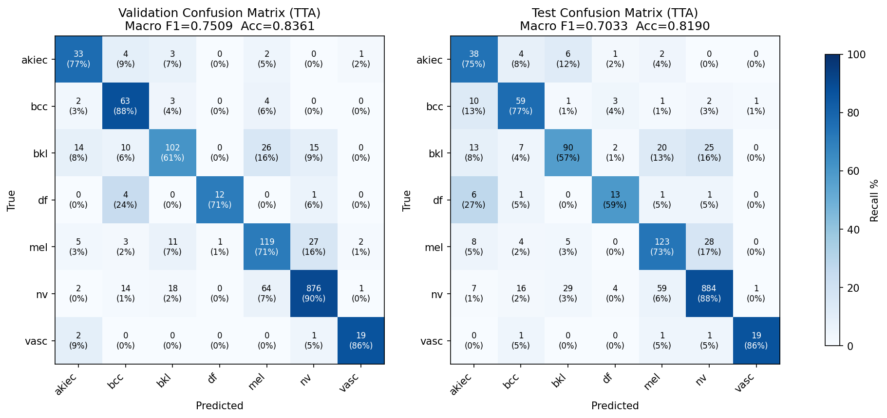

# Model Card — DermWise

This card documents the models behind DermWise: an **EfficientNet-B0** skin-lesion classifier, a
**FAISS RAG** retrieval layer, and a **QLoRA-fine-tuned TinyLlama-1.1B** report generator. Training
and evaluation code: [`training/dermwise_pipeline.ipynb`](training/dermwise_pipeline.ipynb).
Offline metric reproduction: [`huggingface/eval.py`](huggingface/eval.py).

> **Intended use:** research and education only. DermWise is **not** a medical device and must not be
> used for diagnosis or clinical decisions.

---

## 1. Classifier — EfficientNet-B0

### Dataset
- **HAM10000** (Human Against Machine, 10,015 dermoscopic images), 7 diagnostic classes.
- Strong class imbalance — `nv` (melanocytic nevi) dominates at roughly two-thirds of all images,
  while `df` and `vasc` have only ~1% each. This is the central modeling challenge.

| Class | Description | Severity | Test support |
|---|---|---|---|
| akiec | Actinic keratosis / Bowen's | Pre-cancerous | 51 |
| bcc | Basal cell carcinoma | Malignant | 77 |
| bkl | Benign keratosis | Benign | 157 |
| df | Dermatofibroma | Benign | 22 |
| mel | Melanoma | Malignant | 168 |
| nv | Melanocytic nevi | Benign | 1000 |
| vasc | Vascular lesions | Benign | 22 |

### Data split (important)
- Split **by `lesion_id`, not by image.** HAM10000 contains multiple photographs of the same
  physical lesion; splitting at the image level lets the same lesion appear in both train and test,
  leaking information and inflating reported accuracy. We group by lesion first.
- **Stratified** by class, **seed = 42**, ratios **70 / 15 / 15** (train / val / test).
- An explicit assertion verifies the three lesion-ID sets are disjoint ("no data leakage confirmed").
- Resulting sizes: **Val = 1,464 images, Test = 1,497 images** (train ≈ 7,054).

### Preprocessing & augmentation
- Resize to 224×224, ImageNet normalization (mean `[0.485,0.456,0.406]`, std `[0.229,0.224,0.225]`).
- **Train augmentation:** random horizontal/vertical flips, rotation ±20°, color jitter
  (brightness/contrast/saturation 0.15, hue 0.05), random erasing (p=0.15). Val/test: resize + normalize only.

### Handling class imbalance (a deliberate, defensible choice)
- **`WeightedRandomSampler`** with inverse-frequency weights balances class representation per batch.
- **No class weights in the loss** — the notebook deliberately avoids stacking class weighting *on
  top of* the weighted sampler, because doing both over-corrects toward rare classes and widened the
  train/val gap in earlier runs. Loss is plain `CrossEntropyLoss` with **label smoothing = 0.1**.

### Architecture & training
- **EfficientNet-B0**, ImageNet-pretrained backbone, head replaced with `Linear(1280 → 7)`
  (a `Dropout` precedes it). ~4.0M parameters.
- **Two-stage transfer learning:**
  - *Stage 1* — backbone frozen, train head only. 15 max epochs, Adam, LR 1e-3, CosineAnnealing.
  - *Stage 2* — full fine-tune. Adam with **discriminative LRs** (backbone 5e-5, head 5e-4),
    `ReduceLROnPlateau` (mode=max on val macro-F1), weight decay 1e-4.
- **Early stopping** on validation **macro-F1**, patience 10. Best checkpoint at **Stage 2 epoch 18**;
  training stopped at epoch 28. The metric is macro-F1 (not accuracy) precisely because accuracy is
  misleading under heavy imbalance.

### Results (held-out test set, 1,497 images)

| Metric | Standard | TTA |
|---|---|---|
| Accuracy | 0.8130 | **0.8190** |
| Macro F1 | 0.7055 | 0.7033 |

| Class | Precision | Recall | F1 |
|---|---|---|---|
| akiec | 0.463 | 0.745 | 0.571 |
| bcc | 0.641 | 0.766 | 0.698 |
| bkl | 0.687 | 0.573 | 0.625 |
| df | 0.565 | 0.591 | 0.578 |
| mel | 0.594 | **0.732** | 0.656 |
| nv | 0.939 | 0.884 | 0.911 |
| vasc | 0.905 | 0.864 | 0.884 |
| **macro** | 0.685 | 0.737 | **0.703** |



### Test-Time Augmentation (TTA)
- 4 views averaged at softmax level: original + horizontal-flip + vertical-flip + both-flip. The
  deployed `huggingface/app.py` uses the **same four views**, so the live classifier is identical to
  the one these metrics describe.
- **Effect is marginal:** ~+0.6% accuracy, roughly flat macro-F1 on test. Reported honestly.

### Limitations
- Trained only on **dermoscopic** images; performance on ordinary smartphone/clinical photos is not
  characterized and will likely be worse.
- Weakest on rare classes (`df`, `akiec`) due to limited support even after re-sampling.
- 7 fixed classes; any lesion outside them is force-mapped to the nearest class (no "unknown" option).
- Confidence is raw softmax and is **not calibrated**; treat probabilities as relative, not absolute.

---

## 2. Retrieval layer — FAISS RAG

- **Knowledge base:** 53 curated dermatology chunks (`{class, category, text}`) spanning overview,
  appearance, risk factors, differential diagnosis, treatment, prognosis, when-to-refer, plus general
  dermoscopy/screening context.
- **Embedder:** `all-MiniLM-L6-v2` (384-dim).
- **Index:** FAISS `IndexFlatIP` over **L2-normalized** embeddings → inner product = **cosine
  similarity**. Retrieval is class-conditioned (the predicted class biases/filters retrieval) so the
  report is grounded in facts relevant to the detected lesion.

---

## 3. Report generator — TinyLlama-1.1B + QLoRA (trained) / Qwen2.5-7B (served)

### What was fine-tuned
- **Base:** `TinyLlama/TinyLlama-1.1B-Chat-v1.0`, loaded in **4-bit NF4** with double quantization
  (`BitsAndBytesConfig`).
- **QLoRA adapter:** r=16, α=32, dropout=0.05, applied to all attention + MLP projections
  (`q/k/v/o_proj`, `gate/up/down_proj`). **12.6M trainable params = 2.01% of the model.**
- **Training data:** ~189 synthetic clinical reports generated from the knowledge base via 3 report
  templates × 7 classes × 3 confidence bands. Causal-LM objective with labels **masked before the
  `<|assistant|>` turn**, so loss is computed only on the generated report.
- **Optimization:** 5 epochs, AdamW LR 2e-4, grad-accum 4 (effective batch 8), cosine schedule with
  warmup, grad-clip 1.0, fp16 autocast. Best adapter saved on lowest val loss.

### What is actually served (and why)
- The **live demo serves `Qwen/Qwen2.5-7B-Instruct`** via the HuggingFace Serverless Inference API
  (`temperature=0.2, top_p=0.85, max_tokens=512`), **not** the local TinyLlama adapter.
- **Rationale:** on the free CPU tier, a 7B instruction-tuned model produces materially better
  structured medical reports than a 1.1B model, at zero hosting cost. The QLoRA adapter is retained
  as evidence of the fine-tuning work and as a path to fully local inference.

### Guardrails
- Post-generation **fact corrections** (string replacement) fix known dangerous errors (e.g. AK
  "progression to melanoma" → "progression to SCC"; "melanoma is always benign" → "...is malignant").
- Hallucination **cutoff markers** truncate spurious trailing sections (e.g. "FUNDING", "METHODS:").
- Deterministic **template fallback** if the Inference API is unavailable.

---

## 4. Notebook vs. deployed app

The **classifier is now identical** between the notebook (where metrics were measured) and the
deployed `app.py`: same `best_model.pth` weights, same head (`Dropout(0.2) + Linear(7)`), and the
same 4-view TTA (original, h-flip, v-flip, both-flip). The deployed RAG also scores with the same
cosine similarity (L2-normalized query against the normalized FAISS index). So **the reported test
metrics describe the live classification system exactly.**

There is **one intentional difference**, by design (not a defect):

| Aspect | Trained / evaluated | Served in the live demo | Why |
|---|---|---|---|
| Report LLM | TinyLlama-1.1B + QLoRA (local) | Qwen2.5-7B-Instruct (HF Inference API) | A 7B instruct model writes materially better reports than a 1.1B model on the free CPU tier, at zero cost. The QLoRA adapter is retained as fine-tuning evidence and a local-inference path. |

A minor, deliberate simplification: the deployed retrieval derives its query from the predicted
class (`"{class} skin lesion dermoscopy"`) and does not replicate the notebook's optional
`class_filter` pre-pend. This affects only the wording of the generated report, never a reported
metric.

---

## 5. Reproducing the metrics

```bash
cd huggingface
pip install torch torchvision scikit-learn pandas matplotlib --index-url https://download.pytorch.org/whl/cpu
# Requires: models/best_model.pth, the HAM10000 images, and the saved test_split.csv
python eval.py --test-split path/to/test_split.csv --image-root path/to/HAM10000_images
```

The confusion-matrix figure in this card can be re-rendered from the recorded counts with
[`docs/assets/make_confusion_matrix.py`](docs/assets/make_confusion_matrix.py).

---

## 6. Ablations & experiment log

All figures below are from the recorded training/evaluation runs in
[`training/dermwise_pipeline.ipynb`](training/dermwise_pipeline.ipynb).

### 6.1 Two-stage transfer learning (the big lever)

Unfreezing the backbone after the head had warmed up was the single largest improvement —
the linear-probe stage alone is far from sufficient on dermoscopic images.

| Stage | What trains | Best **val** macro-F1 |
|---|---|---|
| Stage 1 — head only (backbone frozen) | classifier head | 0.485 |
| Stage 2 — full fine-tune (backbone unfrozen) | whole network | **0.740** |

→ Fine-tuning the backbone added **+0.255 macro-F1** over the frozen-feature baseline.

### 6.2 Test-Time Augmentation (marginal — reported honestly)

4-view TTA (original + h-flip + v-flip + both-flip), softmax-averaged.

| Split | Variant | Accuracy | Macro-F1 |
|---|---|---|---|
| Validation | Standard | 0.8299 | 0.7398 |
| Validation | TTA | **0.8361** | **0.7509** |
| Test | Standard | 0.8130 | **0.7055** |
| Test | TTA | **0.8190** | 0.7033 |

→ TTA helps slightly on accuracy (~+0.6% test) but is roughly flat on macro-F1 (even marginally
lower on test). It is kept for robustness, not because it is a major contributor. The "best variant"
was selected on the **validation** set (TTA) and then reported on test, to avoid tuning on test.

### 6.3 Class-imbalance strategy (qualitative finding)

HAM10000 is dominated by `nv` (~67%). Two mechanisms were considered:

| Approach | Outcome |
|---|---|
| `WeightedRandomSampler` only (inverse-frequency) | **Chosen.** Balances batches without distorting the loss surface. |
| Weighted sampler **+** class-weighted loss | Rejected — stacking both *over-corrected* toward rare classes and widened the train/val gap. |

Final recipe: weighted sampler + plain `CrossEntropyLoss` with label smoothing (0.1). The
per-class results reflect this: high recall on minority malignant/pre-cancerous classes
(mel 0.73, bcc 0.77, akiec 0.75) without collapsing majority-class precision (nv 0.94).

### 6.4 QLoRA efficiency (report generator)

| Metric | Value |
|---|---|
| Base model | TinyLlama-1.1B-Chat (4-bit NF4) |
| Trainable params | **12.6M (2.01% of the model)** |
| LoRA config | r=16, α=32, dropout=0.05, all attn+MLP projections |

→ Parameter-efficient fine-tuning adapted the model on a single GPU by training only ~2% of weights.
