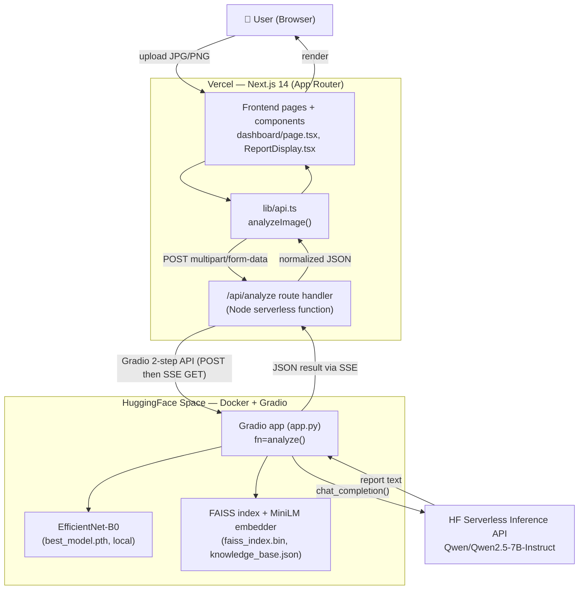
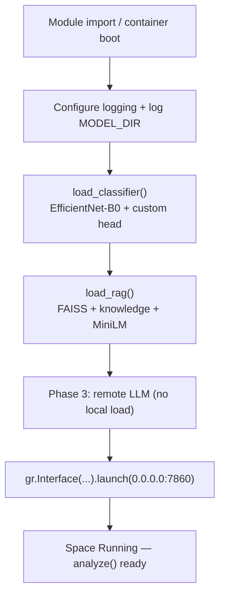
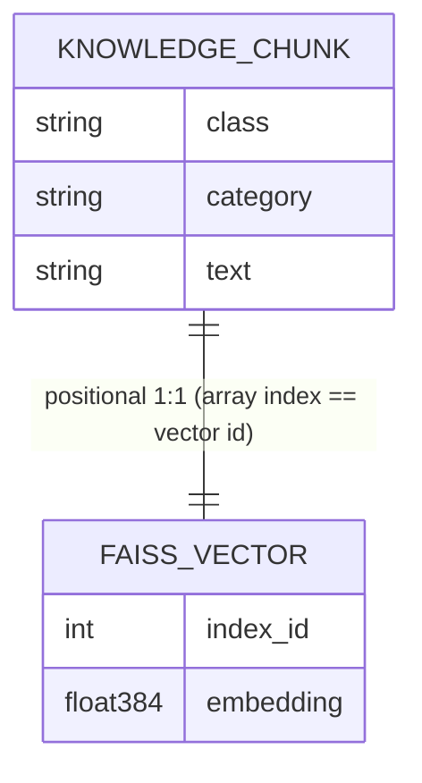
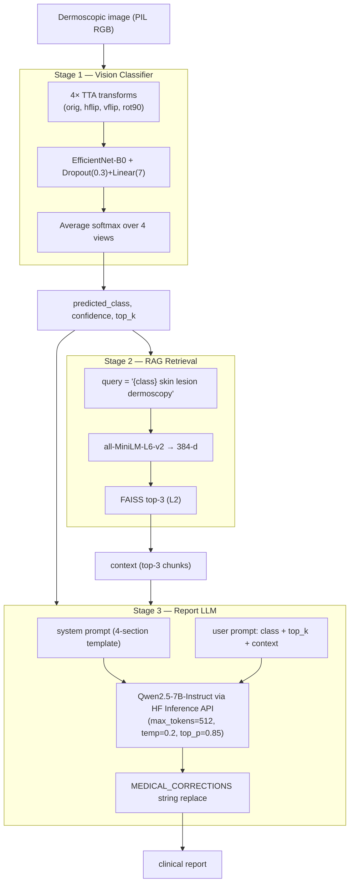
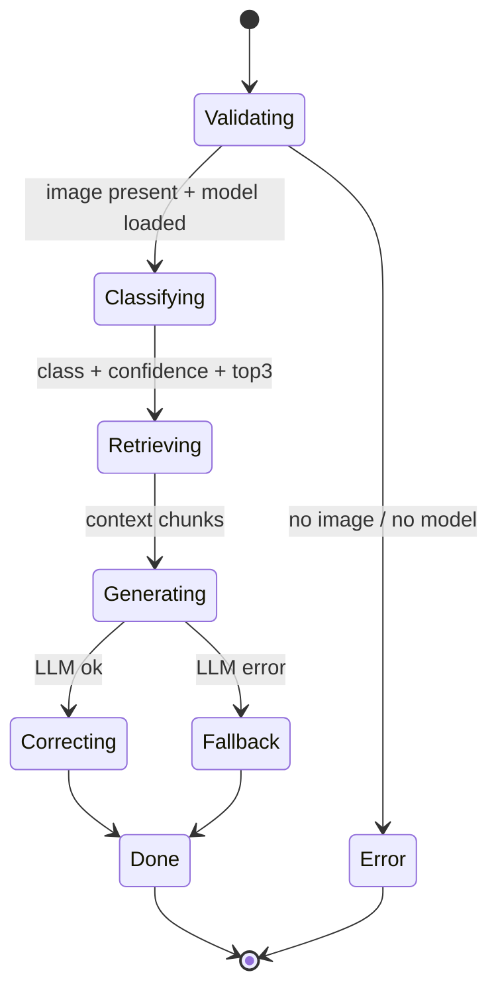
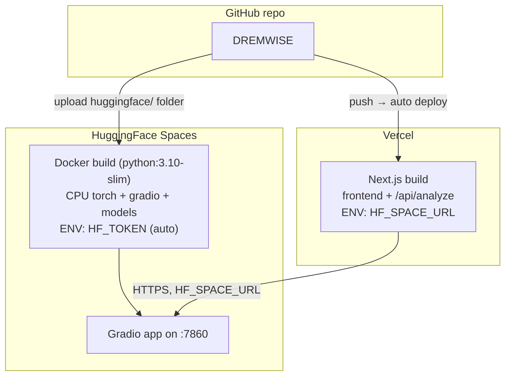

# DermWise — Project Deep Dive & Architecture Review

> A staff-engineer-level reverse-engineering of the DermWise codebase, written for a backend
> engineer who must understand, maintain, extend, and debug the system without any further
> documentation. Every claim below is grounded in actual source files, which are linked inline.

> **⏱️ Point-in-time note.** This review was written as the *initial* analysis. Several issues it
> flags have since been resolved: the TinyLlama-vs-Qwen documentation contradiction is now an
> explicit, intentional design note (see [`README.md`](README.md) Phase 3 and
> [`MODEL_CARD.md`](MODEL_CARD.md) §4); the deployed classifier's TTA and head now match the
> evaluated model exactly; the stale `route.ts` comment is fixed; and evaluation metrics now exist
> ([`MODEL_CARD.md`](MODEL_CARD.md), [`huggingface/eval.py`](huggingface/eval.py)). Treat this
> document as the analysis that *motivated* those changes — the README and model card are the current
> source of truth.

---

## Table of Contents

1. [Executive Summary](#1-executive-summary)
2. [High-Level Architecture](#2-high-level-architecture)
3. [Repository Structure](#3-repository-structure)
4. [Backend Architecture Deep Dive](#4-backend-architecture-deep-dive)
5. [Request Lifecycle](#5-request-lifecycle)
6. [API Documentation](#6-api-documentation)
7. [Data Flow Analysis](#7-data-flow-analysis)
8. [Database / Storage Architecture](#8-database--storage-architecture)
9. [Caching Layer](#9-caching-layer)
10. [Background Jobs & Async Systems](#10-background-jobs--async-systems)
11. [AI / ML / Model Architecture](#11-ai--ml--model-architecture)
12. [Model Request Pipeline](#12-model-request-pipeline)
13. [Automatic Concept Discovery](#13-automatic-concept-discovery)
14. [Concept Encyclopedia](#14-concept-encyclopedia)
15. [Core Business Logic](#15-core-business-logic)
16. [Technical Decisions](#16-technical-decisions)
17. [Design Patterns](#17-design-patterns)
18. [Security Analysis](#18-security-analysis)
19. [Performance & Scalability](#19-performance--scalability)
20. [External Dependencies](#20-external-dependencies)
21. [Infrastructure & Deployment](#21-infrastructure--deployment)
22. [End-to-End Walkthrough](#22-end-to-end-walkthrough)
23. [Debugging Guide](#23-debugging-guide)
24. [Future Improvements](#24-future-improvements)

---

## 1. Executive Summary

**What is this project?**
DermWise is a full-stack **medical AI demo** that classifies dermoscopic (skin-lesion) images
into one of seven diagnostic categories and then generates a structured, human-readable
**clinical report** for the predicted lesion. It is explicitly positioned for *research and
educational use only* — not for clinical diagnosis (see the disclaimer wired throughout:
[ReportDisplay.tsx:138-143](components/ReportDisplay.tsx#L138-L143), [app.py:312-315](huggingface/app.py#L312-L315)).

**What problem does it solve?**
It demonstrates an end-to-end "image → diagnosis → explanation" medical-AI pipeline that
combines three distinct AI techniques — a **convolutional image classifier**, a
**retrieval-augmented knowledge layer (RAG)**, and a **large language model** for natural-language
report writing — and wraps them in a polished, production-shaped web app deployable entirely on
free infrastructure (Vercel + HuggingFace Spaces).

**Who are the users?**
End users upload a single dermoscopic image through a browser dashboard and receive a
classification + confidence + top-3 predictions + a generated clinical report. The intended
audience is students, researchers, and people evaluating the AI pipeline — not patients or
clinicians making real decisions.

**Major features**

| Feature | Where it lives |
|---|---|
| Drag-and-drop image upload with client-side validation | [app/dashboard/page.tsx](app/dashboard/page.tsx) |
| Server-side proxy that hides the AI backend and dodges CORS | [app/api/analyze/route.ts](app/api/analyze/route.ts) |
| EfficientNet-B0 classifier with Test-Time Augmentation (TTA) | [app.py:87-168](huggingface/app.py#L87-L168) |
| FAISS + Sentence-Transformer RAG retrieval | [app.py:175-220](huggingface/app.py#L175-L220) |
| LLM report generation with medical fact-correction + template fallback | [app.py:227-315](huggingface/app.py#L227-L315) |
| Result rendering (severity badges, confidence bars, report) | [components/ReportDisplay.tsx](components/ReportDisplay.tsx) |

**Overall system objective**
Take an uploaded image and return a JSON object of the shape
`{ predictedClass, confidence, topK[], report, retrievedContext }` — produced by a 3-stage AI
pipeline — with the whole thing runnable on free CPU-only hosting.

**Most important components (in priority order)**
1. `huggingface/app.py` — the entire AI backend (classifier + RAG + LLM orchestration).
2. `app/api/analyze/route.ts` — the Next.js proxy that bridges browser ↔ Gradio API.
3. `lib/api.ts` — the typed frontend API client and the data contract.
4. The model artifacts under `huggingface/models/`.

> **⚠️ Critical onboarding note (read this first):** The README, the `app.py` module docstring,
> and the committed `lora_adapter/` directory all claim report generation is done by a
> **locally fine-tuned TinyLlama-1.1B QLoRA model**. **This is not what the running code does.**
> The actual report generation calls the **HuggingFace Serverless Inference API** with
> **`Qwen/Qwen2.5-7B-Instruct`** ([app.py:256-265](huggingface/app.py#L256-L265)). The TinyLlama
> LoRA adapter is shipped in the repo but **never loaded or invoked**. Treat the TinyLlama
> references in docs as stale/aspirational. This is the single biggest source of confusion in the
> codebase — see [§11](#11-ai--ml--model-architecture) and [§16](#16-technical-decisions).

---

## 2. High-Level Architecture

DermWise is a **two-tier, two-host** system with a thin serverless proxy in the middle. There is
**no database, no cache server, no queue, and no worker fleet** — state is entirely transient and
per-request.



**Component responsibilities**

| Component | Tech | Responsibility |
|---|---|---|
| **Frontend** | Next.js 14 App Router, React 18, TailwindCSS, lucide-react | File selection, validation, preview, calling the proxy, rendering results |
| **API Proxy** | Next.js Route Handler (Node runtime, serverless on Vercel) | Receives multipart upload, converts to base64 data-URI, drives the Gradio 2-step API, parses SSE, normalizes the response shape, hides the HF URL |
| **AI Backend** | Python 3.10, Gradio, PyTorch (CPU), FAISS, sentence-transformers | Hosts the 3-stage pipeline as a single `analyze(image)` function exposed as a Gradio endpoint |
| **Image classifier** | EfficientNet-B0 (torchvision), loaded from `best_model.pth` | 7-class lesion classification with 4-view TTA |
| **Knowledge retrieval** | FAISS (`faiss-cpu`) + `all-MiniLM-L6-v2` | Semantic retrieval of top-3 medical knowledge chunks |
| **Report LLM** | Remote `Qwen/Qwen2.5-7B-Instruct` via `huggingface_hub.InferenceClient` | Turns classification + context into a structured clinical report |

**What is deliberately absent:** Database, Redis/cache, Kafka/RabbitMQ queue, Celery/worker
processes, vector DB server (FAISS is an in-process index file, not a server), WebSockets,
authentication, and user accounts. This is a stateless inference demo.

---

## 3. Repository Structure

```
DREMWISE/
├── app/                         # Next.js App Router (routes + pages)
│   ├── layout.tsx               # Root layout (fonts, Navbar/Footer shell, metadata)
│   ├── page.tsx                 # Landing page (Hero/Workflow/Disclaimer marketing)
│   ├── globals.css              # Tailwind layer imports + global styles
│   ├── dashboard/page.tsx       # The real app: upload → analyze → results
│   └── api/analyze/route.ts     # ⭐ Server-side proxy to the HF Gradio backend
│
├── components/                  # Presentational React components
│   ├── Navbar.tsx, Footer.tsx, Hero.tsx, Workflow.tsx, Disclaimer.tsx
│   └── ReportDisplay.tsx        # ⭐ Renders the AnalysisResult (the only API-coupled component)
│
├── lib/
│   └── api.ts                   # ⭐ Typed frontend API client + data contract (AnalysisResult)
│
├── huggingface/                 # ⭐⭐ The entire AI backend (separate deploy target)
│   ├── app.py                   # ⭐⭐⭐ Gradio app: 3-stage pipeline orchestration
│   ├── Dockerfile               # Container build for HF Spaces (docker SDK)
│   ├── requirements.txt         # Python deps (torch installed separately in Dockerfile)
│   ├── README.md                # HF Space config front-matter (sdk: docker)
│   └── models/                  # Model artifacts (~16.5 MB tracked, some via Git LFS)
│       ├── best_model.pth       # EfficientNet-B0 weights (~16 MB)
│       ├── faiss_index.bin      # FAISS index (53 vectors × 384 dim)
│       ├── knowledge_base.json  # 53 medical knowledge chunks
│       └── lora_adapter/        # TinyLlama QLoRA adapter — PRESENT BUT UNUSED at runtime
│           ├── adapter_config.json, adapter_model.safetensors
│           ├── tokenizer*.json, chat_template.jinja
│
├── .env.example                 # NEXT_PUBLIC_HF_SPACE_URL + HF_SPACE_URL
├── next.config.js, tailwind.config.js, postcss.config.js, tsconfig.json
├── package.json                 # Next/React/Tailwind only — no backend deps here
└── README.md                    # Project overview (note: TinyLlama claims are stale)
```

**Folder purposes & interactions**

- **`app/`** — Next.js routing root. `app/api/analyze/route.ts` is the only server-side code in
  the Node tier; everything else is UI. `dashboard/page.tsx` is a `"use client"` component and is
  the sole caller of the API client.
- **`components/`** — Pure presentation. Only `ReportDisplay.tsx` is coupled to the backend data
  shape (`AnalysisResult`). The rest are static marketing UI and are out of scope for backend work.
- **`lib/api.ts`** — The contract boundary. It defines the TypeScript interfaces that *both* the
  proxy output and the UI input must agree on. Change this and you must change `route.ts` and
  `ReportDisplay.tsx` in lockstep.
- **`huggingface/`** — A self-contained Python service with its own deploy lifecycle. It does not
  share code with the Next.js app; the only contract between them is the JSON shape returned by
  `analyze()` and consumed by `route.ts`.

There are **no** `/services`, `/repositories`, `/controllers`, `/workers`, `/db`, or `/agents`
folders — the project is intentionally flat because the backend is a single Python module.

---

## 4. Backend Architecture Deep Dive

There are *two* backends. Be precise about which one you mean.

### 4.1 The Node "backend" — `/api/analyze` route handler

**Framework:** Next.js 14 App Router **Route Handler** ([app/api/analyze/route.ts](app/api/analyze/route.ts)).
It runs as a serverless function (Node.js runtime) on Vercel. There is no Express/Fastify server,
no middleware stack, no DI container, no controllers/services/repositories — it is a single
exported `POST` function.

**Startup flow:** None in the traditional sense. Next.js compiles the route; the function is
cold-started on demand by Vercel. The only module-level state is:

```ts
const HF_SPACE_URL = process.env.HF_SPACE_URL || "";  // route.ts:15
```

**Request handling (the whole "business logic" of the Node tier):**
1. Guard: if `HF_SPACE_URL` unset → `503` ([route.ts:18-24](app/api/analyze/route.ts#L18-L24)).
2. Parse `formData()`, pull the `file` field; if missing → `400` ([route.ts:28-36](app/api/analyze/route.ts#L28-L36)).
3. Read bytes → base64 → build a `data:` URI ([route.ts:38-42](app/api/analyze/route.ts#L38-L42)).
4. **Step 1 of Gradio API:** `POST {HF}/gradio_api/call/analyze` with body
   `{ data: [{ url: dataUri }] }` → returns `{ event_id }` ([route.ts:47-68](app/api/analyze/route.ts#L47-L68)).
5. **Step 2 of Gradio API:** `GET {HF}/gradio_api/call/analyze/{event_id}` → SSE stream, with a
   **5-minute `AbortController` timeout** ([route.ts:73-90](app/api/analyze/route.ts#L73-L90)).
6. Parse SSE text line-by-line for `event: complete` / `event: error`
   ([route.ts:93-115](app/api/analyze/route.ts#L93-L115)).
7. Unwrap the Gradio data array, JSON-parse if the element is a string
   ([route.ts:125-141](app/api/analyze/route.ts#L125-L141)).
8. **Remap** snake_case Python keys → camelCase frontend keys and return
   ([route.ts:144-155](app/api/analyze/route.ts#L144-L155)).

**Error handling:** Layered HTTP status codes — `503` (not configured), `400` (no file),
`502` (backend call/SSE/empty failures), `500` (unexpected). All errors return a JSON body with
`error` and optional `detail`. **Logging** is `console.error` with a `[/api/analyze]` prefix, which
surfaces in Vercel function logs.

**Authentication / authorization / middleware:** **None.** The endpoint is fully open. There is no
`middleware.ts`, no rate limiting, no auth check.

### 4.2 The Python AI backend — `huggingface/app.py`

**Framework:** [Gradio](https://gradio.app) (which itself runs on FastAPI/Uvicorn under the hood).
The app is defined as a single `gr.Interface` ([app.py:399-406](huggingface/app.py#L399-L406)) and
launched on `0.0.0.0:7860` ([app.py:408-409](huggingface/app.py#L408-L409)).

**Server startup flow** (executed once at module import / container boot):
1. Configure logging ([app.py:29-31](huggingface/app.py#L29-L31)).
2. Resolve model paths and log directory contents for debugging
   ([app.py:46-56](huggingface/app.py#L46-L56)).
3. **Load Phase 1 — classifier** via `load_classifier()` ([app.py:322-329](huggingface/app.py#L322-L329)).
   Builds EfficientNet-B0, swaps the head for a 7-class `Dropout(0.3)+Linear`, loads
   `best_model.pth` (`weights_only=True`), moves to CPU, sets `.eval()`.
4. **Load Phase 2 — RAG** via `load_rag()` ([app.py:331-337](huggingface/app.py#L331-L337)).
   Lazily imports FAISS + sentence-transformers, reads the JSON knowledge base, reads the FAISS
   index, instantiates the `all-MiniLM-L6-v2` embedder.
5. Phase 3 needs no local load — it's a remote API call ([app.py:339](huggingface/app.py#L339)).
6. Build and launch the Gradio interface.

This is **eager loading at startup**, wrapped in `try/except` so a failed stage degrades to
`None`/`[]` rather than crashing the whole Space ([app.py:324-337](huggingface/app.py#L324-L337)).

**The single request entrypoint** is `analyze(image)` ([app.py:348-395](huggingface/app.py#L348-L395)):
guards on `None` image and missing classifier, converts to RGB, then runs the three stages in
sequence and returns a dict. Any exception is caught and returned **as JSON** (with traceback) so
Gradio surfaces it instead of swallowing it ([app.py:390-395](huggingface/app.py#L390-L395)).

**Design notes for the Python tier:**
- **Lazy imports** of FAISS/sentence-transformers (`_lazy_import_rag()`,
  [app.py:37-44](huggingface/app.py#L37-L44)) reduce startup memory on the free CPU tier.
- **CPU-pinned** device (`torch.device("cpu")`, [app.py:79](huggingface/app.py#L79)) — the free HF
  tier has no GPU.
- **Defensive degradation** everywhere: missing weights → random-weight model with a warning;
  missing RAG → "No knowledge base available."; LLM failure → template fallback.



---

## 5. Request Lifecycle

End-to-end trace of one "Analyze Image" click:

```mermaid
sequenceDiagram
    participant U as User/Browser
    participant D as dashboard/page.tsx
    participant C as lib/api.ts (analyzeImage)
    participant P as /api/analyze (Node)
    participant G as Gradio /gradio_api/call/analyze
    participant CN as EfficientNet-B0 (TTA)
    participant R as FAISS + MiniLM
    participant L as Qwen2.5-7B (HF Inference API)

    U->>D: select file (drag/drop or browse)
    D->>D: validate() — MIME ∈ {jpeg,png}, size ≤ 10MB
    U->>D: click "Analyze Image"
    D->>D: setLoading(true); start 8s "warming up" timer
    D->>C: analyzeImage(file)
    C->>P: POST /api/analyze (multipart FormData "file")
    P->>P: file → arrayBuffer → base64 → data URI
    P->>G: POST {data:[{url:dataUri}]}  (Step 1)
    G-->>P: { event_id }
    P->>G: GET .../analyze/{event_id}  (Step 2, SSE, 300s timeout)
    G->>CN: classify_with_tta() — 4 views, avg softmax
    CN-->>G: predicted_class, confidence, top_k
    G->>R: retrieve_context(query) — top-3 chunks
    R-->>G: context string
    G->>L: chat_completion(system+user prompts)
    L-->>G: report text
    G->>G: apply MEDICAL_CORRECTIONS
    G-->>P: SSE event: complete + data:[{...}]
    P->>P: parse SSE, unwrap array, remap keys → camelCase
    P-->>C: { predictedClass, confidence, topK, report, retrievedContext }
    C-->>D: AnalysisResult
    D->>D: setResult(data); clear timers
    D->>U: render <ReportDisplay/>
```

**Data transformations along the path:**

| Stage | Input | Output |
|---|---|---|
| Browser | `File` (binary) | `FormData{ file }` |
| Proxy in | multipart | `File` → `ArrayBuffer` → base64 → `data:image/...;base64,...` |
| Gradio call | `{data:[{url}]}` | `{event_id}` |
| Gradio result | SSE text stream | parsed JSON array `[{...}]` |
| Python `analyze` | PIL `Image` | dict `{predicted_class, confidence, top_k, report, retrieved_context}` |
| Proxy out | snake_case dict | camelCase `AnalysisResult` |
| UI | `AnalysisResult` | rendered DOM |

**Validation points:** client-side MIME+size ([page.tsx:32-38](app/dashboard/page.tsx#L32-L38)),
server-side env+file presence ([route.ts:18-36](app/api/analyze/route.ts#L18-L36)), Python
`image is None` / classifier-loaded guards ([app.py:356-360](huggingface/app.py#L356-L360)).
**No caching** at any layer. **Serialization** is JSON throughout except the image, which travels as
multipart → base64 data-URI.

---

## 6. API Documentation

### 6.1 `POST /api/analyze` (Next.js proxy — the public contract)

| Property | Value |
|---|---|
| **Route** | `/api/analyze` |
| **Method** | `POST` |
| **Content-Type** | `multipart/form-data` |
| **Body** | field `file`: the image (JPG/PNG, ≤10 MB enforced client-side) |
| **Query params** | none |
| **Headers** | none required (no auth) |
| **Auth** | none |

**Success `200` response** (defined by `AnalysisResult` in [lib/api.ts:16-27](lib/api.ts#L16-L27)
and produced at [route.ts:144-155](app/api/analyze/route.ts#L144-L155)):

```jsonc
{
  "predictedClass": "Melanoma (MEL)",      // string
  "confidence": 0.8421,                      // number 0–1 (4-dp rounded by Python)
  "topK": [                                  // top-3
    { "className": "Melanoma (MEL)", "probability": 0.8421 },
    { "className": "Melanocytic Nevi (NV)", "probability": 0.1023 },
    { "className": "Benign Keratosis (BKL)", "probability": 0.0312 }
  ],
  "report": "1) Classification Summary ...", // string (LLM or fallback)
  "retrievedContext": "Actinic keratosis ..."// string (RAG chunks)
}
```

**Error responses:**

| Status | Cause | Body |
|---|---|---|
| `400` | No `file` field | `{ error: "No file uploaded." }` |
| `500` | Unexpected exception in handler | `{ error: "Failed to process the image...", detail }` |
| `502` | HF call failed / SSE error / empty result | `{ error: "...", detail }` |
| `503` | `HF_SPACE_URL` not configured | `{ error: "Backend not configured..." }` |

**Frontend integration:** `analyzeImage(file)` ([lib/api.ts:40-58](lib/api.ts#L40-L58)) builds the
`FormData`, `fetch`es the route, throws `Error(body.error)` on non-2xx, and returns the parsed JSON.
The dashboard handles the thrown error and the `loading`/`warmingUp` UX
([page.tsx:88-110](app/dashboard/page.tsx#L88-L110)).

### 6.2 Gradio backend API (internal — consumed only by the proxy)

This is the **Gradio 5.x two-step REST API**, not a hand-written endpoint:

1. **`POST {HF_SPACE_URL}/gradio_api/call/analyze`**
   Body: `{ "data": [ { "url": "<data-uri>" } ] }` → returns `{ "event_id": "<id>" }`.
2. **`GET {HF_SPACE_URL}/gradio_api/call/analyze/{event_id}`**
   Returns a **Server-Sent Events** stream. The proxy reads it as text and scans for
   `event: complete` followed by a `data: [...]` line ([route.ts:93-123](app/api/analyze/route.ts#L93-L123)).

The Python function signature backing this is `analyze(image: PIL.Image) -> dict`
([app.py:348](huggingface/app.py#L348)), wired via `gr.Interface(fn=analyze, inputs=gr.Image,
outputs=gr.JSON)`.

---

## 7. Data Flow Analysis

```mermaid
graph LR
    A["Image file (JPG/PNG)"] --> B["base64 data-URI<br/>(proxy)"]
    B --> C["PIL Image (RGB)<br/>app.py analyze()"]
    C --> D["4× tensor views (TTA)<br/>224×224, ImageNet norm"]
    D --> E["avg softmax → class, conf, top-3"]
    E --> F["query string:<br/>'{class} skin lesion dermoscopy'"]
    F --> G["MiniLM embed → 384-d vector"]
    G --> H["FAISS top-3 search → context chunks"]
    E --> I["LLM prompt (system+user)"]
    H --> I
    I --> J["Qwen2.5-7B report text"]
    J --> K["MEDICAL_CORRECTIONS replace"]
    K --> L["result dict (snake_case)"]
    E --> L
    H --> L
    L --> M["SSE → proxy → camelCase JSON"]
    M --> N["ReportDisplay render"]
```



**Intermediate states & contracts:**
- The **query** for retrieval is *derived from the prediction*, not the user input:
  `f"{predicted_class} skin lesion dermoscopy"` ([app.py:374](huggingface/app.py#L374)). This is
  a "prediction-conditioned retrieval" design (see [§15](#15-core-business-logic)).
- The **LLM never sees the image** — only the textual classification + retrieved context
  ([app.py:243-248](huggingface/app.py#L243-L248)). This is a text-only RAG composition.
- The **data contract** between Python and Node is the dict keys
  `predicted_class / confidence / top_k / report / retrieved_context`
  ([app.py:383-389](huggingface/app.py#L383-L389)), remapped to
  `predictedClass / confidence / topK / report / retrievedContext`.

There is **no persistence** of any intermediate state — every value is in-memory and discarded
after the response.

---

## 8. Database / Storage Architecture

**There is no database.** No SQL, no NoSQL, no ORM, no migrations, no transactions. Data "storage"
in this system is limited to **read-only model artifacts on disk**, loaded once at startup:

| Artifact | Format | Size | Role | Loaded by |
|---|---|---|---|---|
| `best_model.pth` | PyTorch state_dict | ~16 MB | EfficientNet-B0 weights | [app.py:96-99](huggingface/app.py#L96-L99) |
| `faiss_index.bin` | FAISS binary index | ~81 KB | 53 vectors × 384-dim, vector search | [app.py:189-191](huggingface/app.py#L189-L191) |
| `knowledge_base.json` | JSON array | ~24 KB | 53 medical chunks `{class, category, text}` | [app.py:182-185](huggingface/app.py#L182-L185) |
| `lora_adapter/` | safetensors + config | ~50 MB | TinyLlama QLoRA adapter — **unused at runtime** | (not loaded) |

The **FAISS index is the closest thing to a "database"** — it is an in-process vector store, not a
server. The knowledge base is a parallel array: FAISS returns integer indices, which are used to
look up `knowledge[i]` ([app.py:213-218](huggingface/app.py#L213-L218)). The retrieval code defensively
handles both string and dict chunk formats; the actual chunks are dicts with a `text` field
(confirmed: 53 chunks, classes `akiec/bcc/bkl/df/general/mel/nv/vasc`, categories like `overview`,
`appearance`, `treatment`, `dermoscopy`, `risk_factors`, `prognosis`, `when_to_refer`).

**"ER diagram" (logical):**



The implicit **invariant**: `faiss_index.bin` and `knowledge_base.json` must be generated together
and stay aligned by position. If they drift, retrieval returns wrong text for a given vector. The
code guards only against out-of-range indices ([app.py:214](huggingface/app.py#L214)), not against
misalignment.

---

## 9. Caching Layer

**There is no application cache.** No Redis, no in-memory LRU, no HTTP cache headers, no
memoization of results. Each request re-runs the full pipeline.

The only "caching-adjacent" behaviors:
- **Model weights are loaded once at startup** and reused across requests (a form of warm in-memory
  state, not a cache).
- **HuggingFace Spaces cold start**: free-tier Spaces sleep when idle and must reboot, which the
  frontend anticipates with an 8-second "Model is warming up…" message
  ([page.tsx:95-96](app/dashboard/page.tsx#L95-L96), [page.tsx:223-225](app/dashboard/page.tsx#L223-L225)).
- The proxy allows **up to 300 s** for the SSE result to accommodate cold starts and CPU inference
  ([route.ts:73-74](app/api/analyze/route.ts#L73-L74)).

**Opportunity:** Identical images (or identical predicted classes) produce identical RAG context and
near-identical reports — a content-hash cache on the proxy or an LLM-response cache keyed by
`(predicted_class, confidence_bucket)` would cut latency dramatically. See [§24](#24-future-improvements).

---

## 10. Background Jobs & Async Systems

**No background workers, queues, cron jobs, or event-driven workflows exist.** The system is purely
**synchronous request/response**.

The only asynchrony is:
- **Gradio's internal job model**, which the proxy interacts with through the 2-step API: the `POST`
  enqueues a job and returns an `event_id`; the `GET` streams the result via SSE
  ([route.ts:44-115](app/api/analyze/route.ts#L44-L115)). This is Gradio's built-in queue, not an
  application-level queue you maintain.
- **JS `async/await`** in the proxy and client — cooperative concurrency, not parallel workers.

Because there is no queue you own, **concurrency limits are whatever Gradio's default queue and the
single CPU Space allow**. Under load, requests serialize on the Space.

---

## 11. AI / ML / Model Architecture

DermWise is a **3-stage cascade**: a vision classifier → a retrieval layer → a language model.



### Stage 1 — EfficientNet-B0 classifier ([app.py:87-168](huggingface/app.py#L87-L168))
- **Architecture:** torchvision `efficientnet_b0(weights=None)` with the head replaced by
  `Sequential(Dropout(0.3), Linear(in_features, 7))` ([app.py:89-95](huggingface/app.py#L89-L95)).
- **Classes (HAM10000, 7):** `akiec, bcc, bkl, df, mel, nv, vasc`
  ([app.py:59-68](huggingface/app.py#L59-L68)).
- **Preprocessing:** resize 224×224, `ToTensor`, ImageNet mean/std normalization
  ([app.py:108-115](huggingface/app.py#L108-L115)).
- **Test-Time Augmentation:** 4 views — original, horizontal flip, vertical flip, rotate 90°
  ([app.py:118-138](huggingface/app.py#L118-L138)). Softmax probabilities are **averaged** across
  views before `argsort` for the top-3 ([app.py:147-168](huggingface/app.py#L147-L168)). This is an
  inference-time ensemble that reduces variance on a single image.
- **Output:** human-readable class name (e.g. `"Melanoma (MEL)"`), confidence (top prob), and a
  top-3 list of `{class, prob}`.

### Stage 2 — FAISS RAG ([app.py:175-220](huggingface/app.py#L175-L220))
- **Embedder:** `sentence-transformers` `all-MiniLM-L6-v2` (384-dim)
  ([app.py:196](huggingface/app.py#L196)).
- **Index:** FAISS read from `faiss_index.bin` (53 vectors), searched with `index.search(vec, 3)`
  ([app.py:209-210](huggingface/app.py#L209-L210)).
- **Query construction:** `"{predicted_class} skin lesion dermoscopy"`
  ([app.py:374](huggingface/app.py#L374)) — retrieval is conditioned on the *classifier's output*,
  so the LLM gets class-relevant medical facts.
- **Output:** top-3 chunk texts joined with blank lines ([app.py:212-220](huggingface/app.py#L212-L220)).

### Stage 3 — Report generation ([app.py:227-315](huggingface/app.py#L227-L315))
- **Model:** **`Qwen/Qwen2.5-7B-Instruct`** via `huggingface_hub.InferenceClient.chat_completion`
  ([app.py:256-265](huggingface/app.py#L256-L265)) — a **remote, hosted** model, *not* the local
  TinyLlama LoRA.
- **Prompting:** a fixed system prompt forcing 4 sections (Classification Summary, Clinical
  Description, Risk Assessment, Recommended Actions) plus an educational-use disclaimer
  ([app.py:231-237](huggingface/app.py#L231-L237)); the user prompt injects classification + top-k +
  RAG context ([app.py:243-248](huggingface/app.py#L243-L248)).
- **Decoding params:** `max_tokens=512, temperature=0.2, top_p=0.85` — low temperature for factual,
  deterministic-ish medical text ([app.py:260-264](huggingface/app.py#L260-L264)).
- **Guardrail (post-processing):** `MEDICAL_CORRECTIONS` does literal string replacement to scrub
  dangerous factual errors (e.g. "melanoma is always benign" → "melanoma is a malignant condition")
  ([app.py:70-76](huggingface/app.py#L70-L76), [app.py:270-271](huggingface/app.py#L270-L271)).
- **Fallback:** if the Inference API throws, `_fallback_report()` produces a deterministic
  template-based report with a hard-coded severity map
  ([app.py:282-315](huggingface/app.py#L282-L315)).

### The TinyLlama LoRA situation (important)
The repo ships a **QLoRA adapter** for `TinyLlama/TinyLlama-1.1B-Chat-v1.0`
([adapter_config.json:6](huggingface/models/lora_adapter/adapter_config.json#L6)) with
`r=16, lora_alpha=32, lora_dropout=0.05`, targeting all attention + MLP projections
(`q/k/v/o_proj, gate/up/down_proj`) — a textbook QLoRA configuration. **However, `app.py` contains
no `peft`/`transformers` model loading for it.** The README and the `app.py` docstring describe
TinyLlama as the report generator, but the running code uses the remote Qwen model. The most likely
history: the project began with a local fine-tuned TinyLlama, then pivoted to the free serverless
Inference API for quality/throughput on the CPU tier, leaving the adapter and docs behind. (Note the
stale comment at [route.ts:71](app/api/analyze/route.ts#L71) still says "TinyLlama loads lazily".)

---

## 12. Model Request Pipeline

The complete AI execution flow for a single inference, with every transformation:

| # | Step | Code | Transformation |
|---|---|---|---|
| 1 | **Input** | [app.py:348-356](huggingface/app.py#L348-L356) | Receive PIL image; guard `None` |
| 2 | **Preprocess** | [app.py:364](huggingface/app.py#L364) | `image.convert("RGB")` |
| 3 | **Augment** | [app.py:118-138](huggingface/app.py#L118-L138) | Build 4 normalized 224×224 tensors |
| 4 | **Inference (vision)** | [app.py:148-153](huggingface/app.py#L148-L153) | Forward pass per view, softmax |
| 5 | **Ensemble** | [app.py:155-161](huggingface/app.py#L155-L161) | Average probs, `argsort` top-3 |
| 6 | **Context build (query)** | [app.py:374](huggingface/app.py#L374) | Compose retrieval query from class |
| 7 | **Embed** | [app.py:209](huggingface/app.py#L209) | MiniLM encode → float32 384-d |
| 8 | **Retrieve** | [app.py:210-220](huggingface/app.py#L210-L220) | FAISS top-3 → chunk texts |
| 9 | **Prompt construct** | [app.py:231-248](huggingface/app.py#L231-L248) | system + user messages |
| 10 | **Model inference (LLM)** | [app.py:256-267](huggingface/app.py#L256-L267) | Remote `chat_completion` |
| 11 | **Post-process** | [app.py:270-271](huggingface/app.py#L270-L271) | `MEDICAL_CORRECTIONS` replace |
| 12 | **Validate / fallback** | [app.py:275-279](huggingface/app.py#L275-L279) | On error → template report |
| 13 | **Final response** | [app.py:383-389](huggingface/app.py#L383-L389) | Assemble result dict |

There is **no tool calling, no function calling, no agent loop, and no multi-turn memory** — it is a
single deterministic forward pipeline with one LLM call.

---

## 13. Automatic Concept Discovery

Concepts that **actually appear** in this codebase:

| Concept | Present? | Evidence |
|---|---|---|
| **Image classification (CNN, transfer learning)** | ✅ | EfficientNet-B0 [app.py:89-104](huggingface/app.py#L89-L104) |
| **Test-Time Augmentation (TTA)** | ✅ | [app.py:118-168](huggingface/app.py#L118-L168) |
| **Retrieval-Augmented Generation (RAG)** | ✅ | FAISS + LLM [app.py:204-248](huggingface/app.py#L204-L248) |
| **Embeddings / Sentence Transformers** | ✅ | `all-MiniLM-L6-v2` [app.py:196](huggingface/app.py#L196) |
| **Vector database / similarity search** | ✅ | FAISS in-process index [app.py:189-210](huggingface/app.py#L189-L210) |
| **Prompt engineering** | ✅ | system/user templates [app.py:231-248](huggingface/app.py#L231-L248) |
| **LLM inference via hosted API** | ✅ | `InferenceClient.chat_completion` [app.py:256](huggingface/app.py#L256) |
| **QLoRA / PEFT fine-tuning** | ⚠️ artifact only | `adapter_config.json` (adapter shipped, not loaded) |
| **Output guardrails / fact correction** | ✅ | `MEDICAL_CORRECTIONS` [app.py:70-76](huggingface/app.py#L70-L76) |
| **Graceful degradation / fallback** | ✅ | `_fallback_report` [app.py:282-315](huggingface/app.py#L282-L315) |
| **Server-Sent Events (SSE) streaming** | ✅ | Gradio result stream [route.ts:76-115](app/api/analyze/route.ts#L76-L115) |
| **API proxy / BFF pattern** | ✅ | [app/api/analyze/route.ts](app/api/analyze/route.ts) |
| **Containerization (Docker)** | ✅ | [huggingface/Dockerfile](huggingface/Dockerfile) |
| **Lazy loading** | ✅ | `_lazy_import_rag` [app.py:37-44](huggingface/app.py#L37-L44) |
| **Async/await concurrency** | ✅ | proxy + client |

Concepts that are **NOT** present (don't go looking for them): JWT/OAuth/auth, Redis, Kafka,
Celery/queues, WebSockets, gRPC, GraphQL, Kubernetes, multi-agent orchestration, tool/function
calling, MCP, fine-tuning *at runtime*, event sourcing/CQRS, traditional databases.

---

## 14. Concept Encyclopedia

### 14.1 Transfer Learning + EfficientNet-B0

**What is it?** Reusing a network pre-trained on a large dataset (ImageNet) and adapting it to a new
task by replacing/retraining the classification head.
**Why it exists:** Medical datasets like HAM10000 (~10k images) are too small to train a deep CNN
from scratch; pre-trained features transfer well.
**How it works internally:** EfficientNet-B0 uses *compound scaling* (depth/width/resolution scaled
together) and MBConv blocks for a strong accuracy/parameter trade-off (~5.3M params). The
convolutional backbone extracts features; only the head maps features → 7 classes.
**In this project:** [app.py:89-95](huggingface/app.py#L89-L95) swaps `model.classifier` for
`Dropout(0.3)+Linear(in_features,7)`. Note `weights=None` at load time because the *fine-tuned*
weights come from `best_model.pth`, not ImageNet defaults.
**Why chosen:** Small, CPU-friendly, accurate — ideal for a free-tier Space. **Alternatives:**
ResNet-50 (heavier), ViT (data-hungry), MobileNet (lighter but typically less accurate).

### 14.2 Test-Time Augmentation (TTA)

**What is it?** Running inference on several augmented copies of the same input and averaging the
predictions.
**Why it exists:** A single deterministic forward pass can be brittle to orientation/framing; lesion
images have no canonical orientation.
**How it works:** Apply label-preserving transforms (flips, rotations), softmax each, average. It is
an inference-time ensemble of *one* model — cheap variance reduction, no extra training.
**In this project:** 4 transforms in [app.py:118-138](huggingface/app.py#L118-L138); averaging at
[app.py:155-156](huggingface/app.py#L155-L156).
**Tradeoffs:** 4× inference cost per image (significant on CPU), modest accuracy/robustness gain.
Alternatives: a true multi-model ensemble (more accurate, much costlier) or a single pass (faster,
noisier).

### 14.3 Embeddings & Sentence Transformers

**What is it?** Mapping text to dense vectors where semantic similarity ≈ geometric proximity.
**Why it exists:** Keyword search can't match "melanoma" to a chunk about "malignant pigmented
lesions"; embeddings capture meaning.
**How it works:** `all-MiniLM-L6-v2` is a distilled BERT producing 384-d vectors via mean-pooled
token embeddings. Similar meanings → nearby vectors.
**In this project:** [app.py:196](huggingface/app.py#L196), used to encode the retrieval query at
[app.py:209](huggingface/app.py#L209).
**Why chosen:** Tiny (~80 MB), fast on CPU, strong quality-per-size. Alternatives: larger MPNet
models (better, slower), OpenAI embeddings (hosted, costs money + leaks data).

### 14.4 FAISS & Vector Similarity Search

**What is it?** Facebook AI Similarity Search — a library for fast nearest-neighbor search over
vectors.
**Why it exists:** Brute-force similarity over many vectors is slow; FAISS provides optimized
(optionally approximate) search.
**How it works:** Builds an index over stored vectors; `search(query, k)` returns the k closest by
the index's metric (L2 here, given the default `read_index`).
**In this project:** [app.py:189-210](huggingface/app.py#L189-L210). With only 53 vectors this is
effectively exact and instantaneous — FAISS is overkill at this scale but future-proofs growth.
**Alternatives:** in-memory numpy dot products (fine for 53 chunks), or a hosted vector DB
(Pinecone/Weaviate — unnecessary overkill here).

### 14.5 Retrieval-Augmented Generation (RAG)

**What is it?** Augmenting an LLM's prompt with retrieved, authoritative context so it generates
grounded, less-hallucinated output.
**Why it exists:** LLMs hallucinate; injecting vetted medical facts constrains the generation.
**How it works:** (1) embed a query, (2) retrieve top-k relevant chunks, (3) stuff them into the
prompt, (4) generate.
**In this project:** the query is *prediction-conditioned* (the classifier's label, not user text),
retrieval at [app.py:204-220](huggingface/app.py#L204-L220), injection at
[app.py:243-248](huggingface/app.py#L243-L248).
**Why chosen:** Grounds the clinical report in a curated knowledge base, improving factual quality
on a domain a general LLM may get subtly wrong.

### 14.6 QLoRA / PEFT (present as artifact)

**What is it?** Quantized Low-Rank Adaptation — fine-tune a 4-bit-quantized base model by training
small low-rank adapter matrices instead of all weights.
**Why it exists:** Full fine-tuning of even a 1.1B model is memory-heavy; QLoRA makes it feasible on
a single consumer GPU.
**How it works:** Freeze the quantized base; inject trainable rank-`r` matrices `A,B` into target
linear layers (here `q/k/v/o_proj` + MLP projections), so the update is `ΔW = BA`. Only `A,B` train.
**In this project:** `adapter_config.json` shows `r=16, alpha=32, dropout=0.05` over TinyLlama-1.1B.
**But it is not loaded at runtime** — see [§11](#11-ai--ml--model-architecture). Keep it as evidence
of the original design / a future local-inference path.

### 14.7 Server-Sent Events (SSE)

**What is it?** A one-way HTTP streaming protocol where the server pushes `event:`/`data:` lines over
a long-lived response.
**Why it exists here:** Gradio's job API streams results as SSE; CPU inference is slow, so the result
arrives as a stream rather than a single blocking JSON.
**How it works:** The proxy `GET`s the event URL and reads the body as text, scanning for
`event: complete` then the following `data:` line ([route.ts:93-115](app/api/analyze/route.ts#L93-L115)).
Note the proxy reads the **whole** stream with `await resultRes.text()` rather than incrementally —
it's SSE transport but consumed as a single blob.

### 14.8 Backend-for-Frontend / API Proxy Pattern

**What is it?** A server-side endpoint that mediates between the browser and an upstream service.
**Why it exists here:** (1) hide `HF_SPACE_URL` from the browser, (2) avoid CORS, (3) translate the
multipart upload into Gradio's data-URI JSON format, (4) normalize the response shape.
**In this project:** [app/api/analyze/route.ts](app/api/analyze/route.ts) is a textbook BFF.

---

## 15. Core Business Logic

The unique, value-creating workflow is the **prediction-conditioned RAG report pipeline**. Walk it
step by step (in `analyze()`, [app.py:348-395](huggingface/app.py#L348-L395)):

1. **Normalize** the image to RGB so grayscale/RGBA inputs don't break the tensor pipeline
   ([app.py:364](huggingface/app.py#L364)).
2. **Classify with TTA** — the decision core. The averaged-softmax `argsort` selects the label; the
   top probability becomes the confidence; the top-3 feeds both the UI and the LLM prompt
   ([app.py:368-370](huggingface/app.py#L368-L370)).
3. **Condition retrieval on the prediction** — the system does *not* let the user query the
   knowledge base; instead it derives the query from the model's own label
   ([app.py:374](huggingface/app.py#L374)). This is the key design choice: it guarantees the LLM
   receives facts relevant to *what was detected*, keeping the report on-topic.
4. **Generate + correct** — the LLM writes the report under a rigid 4-section schema, then a
   deterministic correction pass scrubs known dangerous misstatements
   ([app.py:380](huggingface/app.py#L380), [app.py:270-271](huggingface/app.py#L270-L271)).
5. **Severity mapping (frontend)** — independently, the UI maps class codes → severity badges
   (`mel/bcc` → Malignant, `akiec` → Pre-cancerous, others → Benign) in
   [ReportDisplay.tsx:5-19](components/ReportDisplay.tsx#L5-L19). The Python fallback report has its
   own parallel `severity_map` ([app.py:284-292](huggingface/app.py#L284-L292)) — **two sources of
   truth for severity** that must be kept consistent.

**What makes it unique:** the layering of a *vision* model's output into a *text* RAG + LLM pipeline,
with the classifier's label acting as the retrieval query — a clean "perceive → ground → explain"
cascade, plus medical safety post-processing.



---

## 16. Technical Decisions

| Decision | Why (inferred) | Advantages | Disadvantages / Risks | Alternatives |
|---|---|---|---|---|
| **Next.js 14 App Router for frontend** | Modern React with built-in serverless route handlers; one framework for UI + proxy | Single deploy on Vercel; co-located API proxy; SSR-ready | Couples proxy lifecycle to Vercel functions; cold starts | Vite SPA + separate API; Remix |
| **Server-side proxy (`/api/analyze`)** | Hide HF URL, dodge CORS, reshape data | Security + clean contract; centralizes error handling | Extra hop/latency; base64 inflates payload ~33% | Direct browser→Gradio (leaks URL, CORS pain) |
| **HuggingFace Spaces (free CPU) for AI** | Zero-cost hosting with Git-LFS model storage and a built-in web API | Free, simple, Docker-based, public URL | Cold starts; slow CPU inference (30–90s first req); sleeps when idle | Render/Fly/AWS (cost), local server |
| **Gradio as the API layer** | Turns a Python function into a web API with ~5 lines | Fast to ship; auto SSE/queue; free UI | Awkward 2-step client API; SSE parsing burden on proxy | FastAPI (more control, more code) |
| **Docker SDK on the Space** | Full control over CPU-only torch install | Smaller image (CPU wheels), reproducible | Slower builds; must manage Dockerfile | Gradio SDK auto-build (less control) |
| **EfficientNet-B0** | Best accuracy-per-param on CPU | ~16 MB weights, fast | Lower ceiling than bigger nets | ResNet/ViT |
| **TTA at inference** | Cheap robustness without retraining | More stable predictions | 4× CPU cost | Single pass; model ensemble |
| **FAISS for 53 chunks** | Standard RAG tooling, future-proof | Scales if KB grows | Overkill now; alignment invariant with JSON | numpy cosine sim |
| **Remote Qwen2.5-7B over local TinyLlama** | Free serverless API gives a much stronger model than a 1.1B running on CPU | Better reports, no local LLM memory/latency | External dependency; rate limits; network failure path; docs now stale | Run TinyLlama LoRA locally (slower/weaker), OpenAI (paid) |
| **No DB / no auth / no cache** | It's a stateless demo; privacy by not storing images | Simplicity; nothing to breach or migrate | No history, no caching wins, no rate limiting | Add Postgres/Redis/auth for productization |
| **String-replace medical guardrail** | Cheap, deterministic safety net for the worst factual errors | Simple, predictable | Brittle: only catches exact phrases | LLM-based fact-checker; structured output validation |

**Scalability implications:** The single CPU Space is the hard bottleneck — requests serialize, and
TTA + the network round-trip to Qwen dominate latency. Horizontal scaling would require upgraded HF
hardware (or moving the Space behind a load balancer / paid tier) and likely a result cache.

---

## 17. Design Patterns

| Pattern | Where | Why / Benefit | Drawback |
|---|---|---|---|
| **Backend-for-Frontend / Proxy** | [route.ts](app/api/analyze/route.ts) | Hides upstream, reshapes data, centralizes errors | Extra hop |
| **Pipeline / Chain of stages** | `analyze()` → classify → retrieve → generate ([app.py:367-389](huggingface/app.py#L367-L389)) | Clear separation of AI stages | Tight in-function coupling (no DI) |
| **Strategy + Fallback** | LLM call vs `_fallback_report` ([app.py:275-279](huggingface/app.py#L275-L279)) | Resilience when the API fails | Two report formats to maintain |
| **Lazy initialization** | `_lazy_import_rag` ([app.py:37-44](huggingface/app.py#L37-L44)) | Lower startup memory | Slight first-use latency |
| **Adapter / Anti-Corruption Layer** | snake_case→camelCase remap ([route.ts:144-155](app/api/analyze/route.ts#L144-L155)) | Frontend stays decoupled from Python naming | Manual mapping to keep in sync |
| **Graceful degradation** | random-weights / "no KB" / template report | Service stays up under partial failure | Silent quality drop if not monitored |
| **Guardrail / post-filter** | `MEDICAL_CORRECTIONS` ([app.py:70-76](huggingface/app.py#L70-L76)) | Safety on generated text | Exact-match only |
| **Ensemble (inference-time)** | TTA averaging | Robust predictions | Compute cost |
| **DTO / typed contract** | `AnalysisResult` ([lib/api.ts:16-27](lib/api.ts#L16-L27)) | Type safety across the boundary | Must mirror server shape manually |

There is **no** Repository, DI container, Service-layer abstraction, CQRS, or Event Sourcing — by
design, given the project's size.

---

## 18. Security Analysis

**Current posture:**
- **Authentication/Authorization:** *None.* `/api/analyze` is fully open — anyone can POST images.
- **Secrets management:** `HF_SPACE_URL` is server-only (good — not `NEXT_PUBLIC_`) and read from
  env ([route.ts:15](app/api/analyze/route.ts#L15)). The `.env.example` *also* lists
  `NEXT_PUBLIC_HF_SPACE_URL`, which would leak the URL to the browser **if** any client code used it
  — currently nothing does, but it's a footgun. `HF_TOKEN` is read from env on the Space
  ([app.py:252](huggingface/app.py#L252)) and never logged.
- **Input validation:** MIME + 10 MB size client-side ([page.tsx:32-38](app/dashboard/page.tsx#L32-L38));
  server checks only file presence ([route.ts:31](app/api/analyze/route.ts#L31)) — **no server-side
  MIME/size/dimension validation**, so a crafted request can bypass the client checks.
- **Rate limiting:** *None* at any layer — the open, unauthenticated, compute-heavy endpoint is
  abusable for resource exhaustion / cost amplification (drives load onto the HF Space and the Qwen
  Inference API).
- **CORS:** Not configured on the route; the proxy pattern makes the browser call same-origin, so the
  HF Space need not allow cross-origin browsers.
- **Prompt injection / AI safety:** The LLM prompt mixes a fixed system prompt with retrieved KB
  text and classifier output ([app.py:243-248](huggingface/app.py#L243-L248)). Because the *user
  cannot inject free text* into the prompt (the query is derived from the model's label and the
  context comes from a *curated* KB), classic prompt injection is largely mitigated by design. The
  `MEDICAL_CORRECTIONS` pass ([app.py:270-271](huggingface/app.py#L270-L271)) is the only output
  guardrail.
- **Data privacy:** Images are processed in-memory and never persisted (no storage layer) — a
  genuine privacy win, as the README claims.
- **Transport:** HTTPS on both Vercel and HF endpoints.

**Potential vulnerabilities & fixes:**
1. **Unauthenticated, unthrottled compute endpoint** → add rate limiting (e.g. per-IP) and/or a
   lightweight token; consider a CAPTCHA on the dashboard.
2. **No server-side file validation** → re-validate MIME/magic-bytes/size/dimensions in `route.ts`
   before forwarding (defense in depth; client checks are trivially bypassed).
3. **Base64 of a 10 MB file in a serverless function** → memory pressure / potential abuse; cap
   server-side and reject early.
4. **`NEXT_PUBLIC_HF_SPACE_URL` in `.env.example`** → remove it to avoid accidental URL exposure.
5. **Guardrail brittleness** → the exact-string corrections miss paraphrases; consider structured
   output + validation or a second-pass checker.

---

## 19. Performance & Scalability

**Latency budget (per request):**
- **HF Space cold start**: seconds to ~a minute when the Space was asleep (free tier sleeps).
- **TTA classification**: 4 forward passes of EfficientNet-B0 on CPU.
- **RAG**: embedding one query + searching 53 vectors — negligible.
- **LLM call**: network round-trip to the Qwen Inference API (the variable cost; subject to queueing
  and rate limits).
- README estimate: **30–90 s first request, 10–30 s subsequent**
  ([README.md:234](README.md#L234)).

**Concurrency:** The proxy and client use async I/O, but the Space is a single CPU instance with
Gradio's default queue — **requests effectively serialize** on the backend. The proxy's 300 s
timeout ([route.ts:74](app/api/analyze/route.ts#L74)) tolerates this but does not parallelize it.

**Bottlenecks (ranked):**
1. Single free-tier CPU Space (no horizontal scaling, cold starts, idle sleep).
2. TTA's 4× inference cost on CPU.
3. Remote LLM round-trip + potential rate limiting.
4. Base64 payload inflation (~33%) through the proxy.

**Optimization suggestions:**
- **Cache** results by image content hash and/or LLM output by `(class, confidence-bucket)` (no
  cache exists today — [§9](#9-caching-layer)).
- **Make TTA optional** or reduce to 2 views for a fast path.
- **Stream the SSE incrementally** to the client instead of `await text()` so the user sees progress;
  could enable partial/streamed report rendering.
- **Upgrade HF hardware** or move to an always-warm instance to kill cold starts.
- **Batch** is N/A (single-image), but a warmup ping on dashboard load could pre-wake the Space.

---

## 20. External Dependencies

**Frontend ([package.json](package.json)):**

| Dependency | Purpose | Notes / Alternatives |
|---|---|---|
| `next@^14.2` | React framework + serverless route handler (the proxy) | Remix, plain Vite+API |
| `react` / `react-dom@^18.3` | UI runtime | — |
| `lucide-react@^0.469` | Icons in dashboard/report | react-icons, heroicons |
| `tailwindcss`, `postcss`, `autoprefixer` | Styling | CSS modules, styled-components |
| `typescript`, `@types/*` | Types | — |

**Backend ([huggingface/requirements.txt](huggingface/requirements.txt) + Dockerfile):**

| Dependency | Purpose | Why chosen / Alternatives |
|---|---|---|
| `torch`, `torchvision` (CPU wheels, installed in Dockerfile) | EfficientNet-B0 model + transforms | CPU index saves ~2 GB vs CUDA ([Dockerfile:11-13](huggingface/Dockerfile#L11-L13)); alt: ONNX Runtime |
| `gradio` (installed in Dockerfile) | Expose `analyze()` as web API + UI | FastAPI for more control |
| `sentence-transformers` | MiniLM embeddings for RAG | OpenAI embeddings (paid) |
| `faiss-cpu` | Vector similarity search | numpy at this scale |
| `Pillow` | Image I/O | — |
| `numpy` | Softmax averaging / argsort | — |
| `huggingface_hub[inference]` | `InferenceClient.chat_completion` to Qwen | direct REST, OpenAI SDK |

Note `torch`/`gradio` are **not** in `requirements.txt` — they are installed explicitly in the
[Dockerfile](huggingface/Dockerfile#L11-L17) (torch from the CPU index, gradio appended to the pip
install) to control size and source.

---

## 21. Infrastructure & Deployment

**Two independent deploy targets:**



**Frontend (Vercel):** import the repo, framework auto-detected as Next.js, build `npm run build`,
output `.next`, set env var `HF_SPACE_URL` ([README.md:181-196](README.md#L181-L196)). Auto-deploys
on push.

**Backend (HuggingFace Spaces, Docker SDK):** The Space is configured via the front-matter in
[huggingface/README.md](huggingface/README.md#L1-L10) (`sdk: docker`). The
[Dockerfile](huggingface/Dockerfile) does: `python:3.10-slim` base → install git/git-lfs/build tools
→ install **CPU-only** torch/torchvision from the PyTorch CPU index → install `requirements.txt` +
`gradio` → copy app + models → create non-root `user` (uid 1000, HF requirement) → `EXPOSE 7860` →
`CMD python app.py`. Deploy by uploading the `huggingface/` folder to the Space repo
([README.md:148-179](README.md#L148-L179)); large model files use Git LFS.

**Environment variables:**

| Variable | Tier | Purpose |
|---|---|---|
| `HF_SPACE_URL` | Vercel (server) | Upstream Gradio base URL the proxy calls ([route.ts:15](app/api/analyze/route.ts#L15)) |
| `NEXT_PUBLIC_HF_SPACE_URL` | (in `.env.example` only) | Would expose URL to browser — currently unused; recommend removing |
| `HF_TOKEN` | HF Space | Auth for the Inference API; auto-set in Spaces ([app.py:252](huggingface/app.py#L252)) |

**Runtime architecture:** Vercel serverless function (Node) ↔ HTTPS ↔ HF Docker container running a
long-lived Gradio/Uvicorn process serving `/gradio_api/...`.

---

## 22. End-to-End Walkthrough

**Scenario:** A user uploads `mole.jpg`; the model predicts Melanoma.

1. **Browser** — User drags `mole.jpg` into the dropzone
   ([page.tsx:61-66](app/dashboard/page.tsx#L61-L66)). `validate()` confirms `image/jpeg` and
   < 10 MB ([page.tsx:32-38](app/dashboard/page.tsx#L32-L38)); a preview URL is created.
2. **Click Analyze** — `handleAnalyze()` sets `loading`, starts the 8 s "warming up" timer, and calls
   `analyzeImage(file)` ([page.tsx:88-99](app/dashboard/page.tsx#L88-L99)).
3. **Client** — `analyzeImage` builds `FormData{file}` and `POST`s `/api/analyze`
   ([lib/api.ts:40-47](lib/api.ts#L40-L47)).
4. **Proxy in** — `route.ts` validates env + file, reads bytes → base64 →
   `data:image/jpeg;base64,...` ([route.ts:28-42](app/api/analyze/route.ts#L28-L42)).
5. **Gradio step 1** — `POST {HF}/gradio_api/call/analyze` with `{data:[{url:dataUri}]}` → `event_id`
   ([route.ts:47-62](app/api/analyze/route.ts#L47-L62)).
6. **Gradio step 2** — `GET .../analyze/{event_id}` opens the SSE stream (≤300 s)
   ([route.ts:76-79](app/api/analyze/route.ts#L76-L79)).
7. **Python classify** — `analyze()` converts to RGB, runs `classify_with_tta`: 4 views → averaged
   softmax → `("Melanoma (MEL)", 0.84, top3)` ([app.py:368-370](huggingface/app.py#L368-L370)).
8. **Python retrieve** — query `"Melanoma (MEL) skin lesion dermoscopy"` → MiniLM embed → FAISS
   top-3 → melanoma context chunks ([app.py:373-376](huggingface/app.py#L373-L376)).
9. **Python generate** — system+user prompts → `Qwen2.5-7B-Instruct` `chat_completion` → report text
   → `MEDICAL_CORRECTIONS` scrub ([app.py:378-380](huggingface/app.py#L378-L380), [app.py:256-271](huggingface/app.py#L256-L271)).
10. **Python return** — dict `{predicted_class, confidence:0.84, top_k, report, retrieved_context}`
    ([app.py:383-389](huggingface/app.py#L383-L389)) → Gradio emits `event: complete` + `data:[{...}]`.
11. **Proxy out** — parse SSE, unwrap `data[0]`, JSON-parse if string, remap keys → camelCase, return
    `200` ([route.ts:93-155](app/api/analyze/route.ts#L93-L155)).
12. **Render** — dashboard `setResult` → `<ReportDisplay>` shows "Melanoma (MEL)", a red
    "Malignant" badge ([ReportDisplay.tsx:10](components/ReportDisplay.tsx#L10)), an 84% confidence
    bar, top-3 bars, the clinical report split into paragraphs, and the disclaimer.

---

## 23. Debugging Guide

**Run locally**
```bash
# Frontend
npm install
cp .env.example .env.local      # set HF_SPACE_URL=https://<user>-dermwise.hf.space
npm run dev                      # http://localhost:3000  (dashboard at /dashboard)

# Backend (optional, to run the AI service locally)
cd huggingface
pip install torch torchvision --index-url https://download.pytorch.org/whl/cpu
pip install -r requirements.txt gradio
python app.py                    # Gradio on http://localhost:7860
# then set HF_SPACE_URL=http://localhost:7860 in .env.local
```

**Where the logs are**
- **Proxy:** `console.error("[/api/analyze] ...")` → Vercel function logs / terminal in dev
  ([route.ts:55,85,109,118,133,157](app/api/analyze/route.ts#L55)).
- **Python:** `logger` (`dermwise`) at INFO → HF Space "Logs" tab; startup logs the MODEL_DIR
  contents ([app.py:53-56](huggingface/app.py#L53-L56)) and each pipeline step
  ([app.py:365-381](huggingface/app.py#L365-L381)).

**Common failure points & what they mean**

| Symptom | Likely cause | Where to look |
|---|---|---|
| `503 Backend not configured` | `HF_SPACE_URL` unset on Vercel | [route.ts:18-24](app/api/analyze/route.ts#L18-L24) |
| Long wait then `"Model is warming up"` | HF Space cold start (was asleep) | [page.tsx:95-96](app/dashboard/page.tsx#L95-L96) |
| `502 AI backend returned an error` | Gradio call failed / wrong URL / Space down | [route.ts:53-60](app/api/analyze/route.ts#L53-L60) |
| `502 ...empty results` | SSE had no `complete` event / shape changed | [route.ts:117-138](app/api/analyze/route.ts#L117-L138) |
| Request aborts ~5 min | 300 s timeout hit (Space too slow / stuck) | [route.ts:73-74](app/api/analyze/route.ts#L73-L74) |
| Report looks templated/generic | LLM API failed → fallback report used | [app.py:275-315](huggingface/app.py#L275-L315) |
| "Classifier model not loaded" in result | `best_model.pth` missing on Space | [app.py:96-101](huggingface/app.py#L96-L101), [app.py:359-360](huggingface/app.py#L359-L360) |
| "No knowledge base available." in context | FAISS/KB/embedder missing | [app.py:206-207](huggingface/app.py#L206-L207) |
| Random/garbage predictions | Classifier loaded with random weights (no `.pth`) | [app.py:100-101](huggingface/app.py#L100-L101) |

**Debugging tips**
- Reproduce the backend independently with the Gradio 2-step API (curl the
  `/gradio_api/call/analyze` endpoints) to isolate proxy vs. backend issues.
- Check the Space "Logs" tab for the `MODEL_DIR contents` line to confirm artifacts shipped (Git LFS
  pull failures are a classic cause of missing weights).
- Because errors are returned **as JSON with traceback** ([app.py:390-395](huggingface/app.py#L390-L395)),
  inspect the proxy's `502 detail` field to see the Python traceback.

---

## 24. Future Improvements

**Correctness / consistency (do these first)**
1. **Resolve the TinyLlama vs. Qwen contradiction.** Either wire up the local LoRA adapter or delete
   it and fix the README/docstring/comment ([README.md:138-142](README.md#L138-L142),
   [app.py:1-16](huggingface/app.py#L1-L16), [route.ts:71](app/api/analyze/route.ts#L71)). Right now
   the docs actively mislead new engineers.
2. **Single source of truth for severity.** Unify the three severity definitions
   ([ReportDisplay.tsx:5-13](components/ReportDisplay.tsx#L5-L13),
   [app.py:284-292](huggingface/app.py#L284-L292)) so they can't drift.

**Reliability**
3. **Server-side input validation** (MIME magic bytes, size, dimensions) in `route.ts`.
4. **Stream the SSE incrementally** rather than `await text()` to render partial results and avoid
   buffering the whole stream ([route.ts:93](app/api/analyze/route.ts#L93)).
5. **Retry/backoff** around the HF Inference API call and the Gradio call (transient 5xx/rate limits).

**Performance / scale**
6. **Add a result cache** (content-hash or class-bucketed) — none exists ([§9](#9-caching-layer)).
7. **Warm-up ping** on dashboard mount to hide cold starts.
8. **Optional/lighter TTA** fast path to cut CPU cost 2–4×.
9. **Upgrade HF hardware** or move to an always-warm runtime for production traffic.

**Security**
10. **Rate limiting + (optional) auth** on the open `/api/analyze` endpoint.
11. **Remove `NEXT_PUBLIC_HF_SPACE_URL`** from `.env.example` to avoid accidental URL exposure.

**AI quality**
12. **Stronger guardrails** than exact-string replacement (structured output validation, a
    fact-check pass, confidence-thresholded "uncertain" responses).
13. **Calibration / abstention**: surface a low-confidence warning when top-1 prob is near the
    decision boundary, and consider returning "uncertain — please retake the photo".
14. **Evaluation harness**: there are no tests or eval scripts; add a small held-out set to track
    classifier accuracy and report-quality regressions.

**Technical debt summary:** stale docs (TinyLlama), duplicated severity logic, no tests, no caching,
no rate limiting, manual snake↔camel mapping, SSE read non-incrementally, and a shipped-but-unused
50 MB LoRA adapter inflating the repo/Space.

---

*Generated from a full read of the repository. Every behavioral claim is anchored to a file and line
reference above. When in doubt, the running truth is `huggingface/app.py` (backend) and
`app/api/analyze/route.ts` (proxy) — trust the code over the README where they disagree.*
