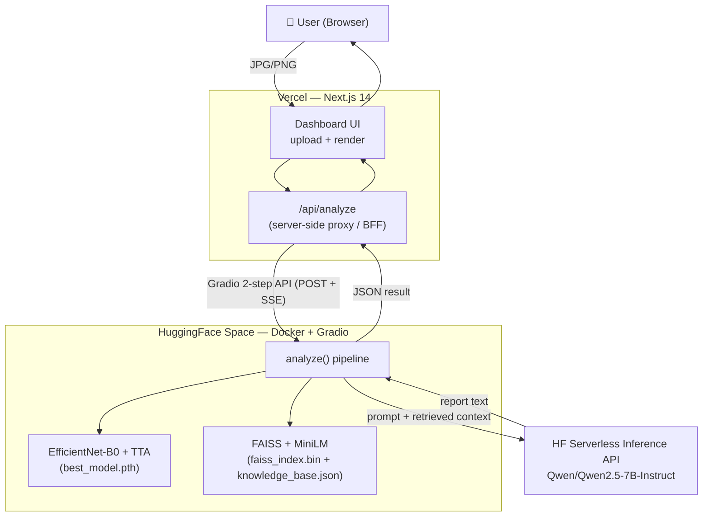
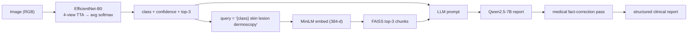

# DermWise — AI Skin Lesion Analysis

> A full-stack medical-AI application that classifies dermoscopic skin-lesion images into 7
> diagnostic categories and generates a grounded, structured clinical report. Built as a
> demonstration of an end-to-end **vision → retrieval → language** AI pipeline.

**⚠️ For research and educational use only. Not a medical device and not for diagnosis.**

---

## 🎯 What it does

Upload a dermoscopic image → DermWise runs a **three-stage AI pipeline** and returns a
classification, confidence, top-3 predictions, and an AI-generated clinical report grounded in a
curated medical knowledge base.

1. **Classification** — EfficientNet-B0 (transfer learning) with **Test-Time Augmentation (TTA)**
2. **Knowledge Retrieval** — **RAG** via FAISS + Sentence-Transformers over 53 curated medical chunks
3. **Report Generation** — an instruction-tuned LLM writes a structured 4-section report grounded in the retrieved context

**Supported classes (HAM10000 dataset):**

| Code | Lesion | Severity |
|---|---|---|
| AKIEC | Actinic Keratosis | Pre-cancerous |
| BCC | Basal Cell Carcinoma | Malignant |
| BKL | Benign Keratosis | Benign |
| DF | Dermatofibroma | Benign |
| MEL | Melanoma | Malignant |
| NV | Melanocytic Nevi | Benign |
| VASC | Vascular Lesions | Benign |

---

## 🏗️ Architecture

**Frontend:** Next.js 14 (App Router) + React 18 + TailwindCSS → deployed on **Vercel**
**Backend:** Python + Gradio (3-stage AI pipeline) → deployed on **HuggingFace Spaces (Docker, free CPU)**
**Bridge:** a server-side Next.js proxy (`/api/analyze`) hides the backend URL and avoids CORS.



**Pipeline data flow:**



> A deeper architectural walkthrough (request lifecycle, design patterns, technical decisions) lives
> in [`PROJECT_DEEP_DIVE.md`](PROJECT_DEEP_DIVE.md).

---

## 🤖 AI pipeline details

### Phase 1 — EfficientNet-B0 classifier
- **Input:** 224×224 dermoscopic image, ImageNet normalization
- **Backbone:** EfficientNet-B0 (transfer learning) with a custom `Dropout(0.2) + Linear(7)` head
- **Test-Time Augmentation:** 4 views (original, h-flip, v-flip, both-flip); softmax probabilities
  are averaged across views for a more robust prediction (identical to the evaluated model)
- **Output:** predicted class + top-3 probabilities

### Phase 2 — FAISS knowledge retrieval (RAG)
- **Embedder:** `all-MiniLM-L6-v2` (384-dim sentence embeddings)
- **Index:** FAISS over 53 curated medical knowledge chunks
- **Design choice:** the retrieval query is built from the **classifier's predicted class**
  (`"{class} skin lesion dermoscopy"`), so the LLM receives facts relevant to what was detected —
  this also incidentally hardens the system against prompt injection (the user supplies no free text
  to the prompt)
- **Output:** top-3 relevant medical facts as grounding context

### Phase 3 — Clinical report generation

> **Design note — TinyLlama (fine-tuned) vs. Qwen (served), read this:**
> TinyLlama-1.1B-Chat was **fine-tuned with QLoRA** for clinical report generation, and the trained
> adapter ships in [`huggingface/models/lora_adapter/`](huggingface/models/lora_adapter/) (training
> code in [`/training`](training/)). **The live demo, however, generates reports via the HuggingFace
> Serverless Inference API using `Qwen/Qwen2.5-7B-Instruct`.**
>
> This was a deliberate **quality/latency trade-off**: a 7B instruction-tuned model produces
> materially better structured medical reports than a 1.1B model running on the free CPU tier, at
> zero hosting cost. The QLoRA adapter is retained as (a) evidence of the fine-tuning work and
> (b) a ready path to fully local inference. See `generate_report()` in
> [`huggingface/app.py`](huggingface/app.py).

- **Served model:** `Qwen/Qwen2.5-7B-Instruct` (`max_tokens=512, temperature=0.2, top_p=0.85`)
- **Fine-tuned model (shipped, not served):** TinyLlama-1.1B + QLoRA (4-bit, r=16, α=32)
- **Guardrail:** a post-generation fact-correction pass scrubs known dangerous misstatements
  (e.g. "melanoma is always benign")
- **Fallback:** if the Inference API is unavailable, a deterministic template-based report is returned
- **Output sections:** Classification Summary · Clinical Description · Risk Assessment · Recommended Actions

---

## 📊 Results & evaluation

All numbers below are on the **held-out test set (1,497 images)**. Crucially, the data is split
**by `lesion_id`, not by image** — the same physical lesion is photographed multiple times in
HAM10000, so an image-level split would leak lesions between train and test and inflate the score.
The split is stratified, seeded (42), 70/15/15, and asserts zero lesion overlap. Reproduce with
[`huggingface/eval.py`](huggingface/eval.py); full methodology in [`MODEL_CARD.md`](MODEL_CARD.md).

| Metric (test set) | Value |
|---|---|
| **Accuracy** | **81.9%** |
| **Macro F1** | **0.703** |
| **Melanoma (MEL) recall** | **73.2%** |
| Validation Macro F1 | 0.751 |

**Per-class (test, TTA):**

| Class | Precision | Recall | F1 | Support |
|---|---|---|---|---|
| akiec (pre-cancer) | 0.463 | 0.745 | 0.571 | 51 |
| bcc (malignant) | 0.641 | 0.766 | 0.698 | 77 |
| bkl (benign) | 0.687 | 0.573 | 0.625 | 157 |
| df (benign) | 0.565 | 0.591 | 0.578 | 22 |
| **mel (malignant)** | 0.594 | **0.732** | 0.656 | 168 |
| nv (benign) | 0.939 | 0.884 | 0.911 | 1000 |
| vasc (benign) | 0.905 | 0.864 | 0.884 | 22 |
| **macro avg** | 0.685 | 0.737 | **0.703** | 1497 |


**Notes & honest caveats:**
- Performance is strongest on the common `nv` class (F1 0.91) and weakest on the rare `df`/`akiec`
  classes (F1 ~0.57) — the expected effect of class imbalance even after re-sampling.
- The model favors **recall on malignant/pre-cancerous classes** (mel 0.73, bcc 0.77, akiec 0.75)
  at the cost of precision — a deliberately appropriate bias for a *screening* tool, where missing a
  melanoma is far worse than a false alarm.
- **Test-Time Augmentation gave only marginal gains** (≈+0.6% accuracy, roughly flat macro-F1). It
  is kept for robustness but is not a major contributor — reported honestly rather than overclaimed.

**Ablations / experiment log** (head-only vs full fine-tune, TTA, imbalance strategy, QLoRA
efficiency): see [`MODEL_CARD.md` §6](MODEL_CARD.md#6-ablations--experiment-log). Headline: unfreezing
the backbone added **+0.255 macro-F1** over the frozen-feature baseline.

---

## 🔍 Explainability (Grad-CAM)

A black-box medical classifier is hard to trust. **Grad-CAM** (Gradient-weighted Class Activation
Mapping) produces a heatmap over the input image showing *which pixels most influenced the
prediction* — verifying the model attends to the **lesion itself**, not to artifacts like rulers,
ink markings, hair, or vignetting (a well-known failure mode in dermoscopy datasets).

It works by taking the gradient of the predicted-class score with respect to the last convolutional
feature maps, using those gradients to weight the maps, and projecting the result back onto the image.

Generate heatmaps (one correctly-classified example per class) with
[`training/gradcam.py`](training/gradcam.py):

```bash
python training/gradcam.py   # produces docs/assets/gradcam_examples.png
```

<!-- GRADCAM_IMAGE -->
_Heatmap grid is generated by the script above and embedded here._

---

## 🚀 Quick start

### Prerequisites
- Node.js 18+ and npm
- (Optional, to run the AI backend locally) Python 3.10+

### 1. Frontend

```bash
npm install
cp .env.example .env.local        # set HF_SPACE_URL=https://<your-space>.hf.space
npm run dev                        # http://localhost:3000  →  /dashboard
```

### 2. AI backend (optional — to run the Space locally)

```bash
cd huggingface
pip install torch torchvision --index-url https://download.pytorch.org/whl/cpu
pip install -r requirements.txt gradio
python app.py                      # Gradio on http://localhost:7860
# then point the frontend at it: HF_SPACE_URL=http://localhost:7860
```

---

## 📦 Project structure

```
DREMWISE/
├── app/
│   ├── page.tsx                 # Landing page
│   ├── dashboard/page.tsx       # Upload & analysis UI
│   └── api/analyze/route.ts     # Server-side proxy → HF Space (hides URL, dodges CORS)
├── components/                  # React UI (ReportDisplay renders the AnalysisResult)
├── lib/api.ts                   # Typed frontend API client + data contract
├── huggingface/                 # AI backend (separate deploy target)
│   ├── app.py                   # Gradio app — 3-stage pipeline
│   ├── Dockerfile               # CPU-only torch build for HF Spaces
│   ├── eval.py                  # Offline metric reproduction (held-out test set)
│   ├── requirements.txt
│   └── models/                  # best_model.pth · faiss_index.bin · knowledge_base.json · lora_adapter/
├── training/                    # Training & fine-tuning notebook (classifier, RAG, QLoRA) + README
├── docs/assets/                 # Confusion-matrix figure + render script
├── MODEL_CARD.md                # Dataset, split, training config, per-class metrics, limitations
├── PROJECT_DEEP_DIVE.md         # Full architecture review
└── README.md
```

---

## 🛠️ Tech stack

| Layer | Technology | Purpose |
|---|---|---|
| **Frontend** | Next.js 14, React 18, TailwindCSS, lucide-react | UI + server-side proxy |
| **Backend** | Gradio (on FastAPI/Uvicorn), Docker | Expose the pipeline as a web API |
| **Vision** | PyTorch, torchvision, EfficientNet-B0 | Image classification + TTA |
| **Retrieval** | FAISS, sentence-transformers (MiniLM) | RAG knowledge retrieval |
| **LLM** | Qwen2.5-7B-Instruct (served) · TinyLlama-1.1B + QLoRA (fine-tuned) | Clinical report generation |
| **Deployment** | Vercel (frontend) · HuggingFace Spaces (backend) | Free hosting |

---

## 🔒 Security & privacy

- **API proxy** — the HuggingFace backend URL is server-side only, never exposed to the browser
- **No data storage** — images are processed in-memory and never persisted
- **No free-text prompt path** — the LLM prompt is built from the model's prediction + a curated
  knowledge base, mitigating prompt injection
- **HTTPS** on both hosting platforms

---

## 🧭 Production considerations (future work)

This is a portfolio/demo project and intentionally omits production infrastructure. For a real
deployment the following would be added (and are discussed in
[`PROJECT_DEEP_DIVE.md`](PROJECT_DEEP_DIVE.md)):

- **Result caching** (content-hash or class-bucketed) to cut repeat latency
- **Rate limiting + authentication** on the public analyze endpoint
- **Retry/backoff** around the LLM and Gradio calls; incremental SSE streaming to the client
- **Server-side input re-validation** (magic-bytes/size/dimensions) for defense in depth
- **Always-warm hardware** to eliminate free-tier cold starts
- **Monitoring + an automated evaluation/regression harness**

---

## 📚 Dataset & acknowledgments

- **HAM10000** (10,015 dermoscopic images) — Harvard Dataverse
- **EfficientNet** — Google Research · **TinyLlama** — TinyLlama authors · **Qwen** — Alibaba
- **HuggingFace** (model hosting, Inference API, Gradio, Spaces) · **Vercel** (frontend hosting)

---

## 📝 License

For **research and educational purposes only**. Not approved for medical diagnosis or clinical
decision-making.
```